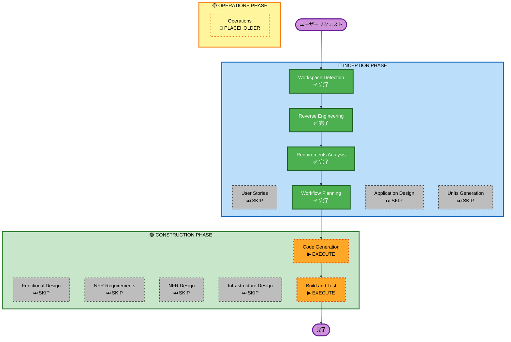

# 実行計画（詳細データ表示機能）

## 詳細分析サマリー

### 変更スコープ
- **変更タイプ**: Multiple Components（新規APIエンドポイント + 新規モーダルコンポーネント + 既存コンポーネント変更）
- **主な変更**:
  - 新規APIエンドポイント `/api/ranking/[companyId]`
  - 新規モーダルコンポーネント `SalaryDetailModal`
  - `RankingTable` をClient Componentへ変更（クリックハンドラー追加）
  - `src/api/ranking.ts` に詳細データ取得クライアント関数追加

### 変更影響評価
- **ユーザー向け変更**: あり — ランキング行クリックで詳細データモーダルが表示される
- **構造変更**: 軽微 — `RankingTable` が Server Component → Client Component に変わる
- **データモデル変更**: なし — 既存 `salary` テーブルをそのまま利用
- **API変更**: あり — 新規エンドポイント `/api/ranking/[companyId]` を追加
- **NFR影響**: なし — モーダル開時のみAPIコール（遅延ロード）

### コンポーネント関係
- **変更対象**: `RankingTable`（Client Component化）
- **新規作成**: `SalaryDetailModal`、`/api/ranking/[companyId]/route.ts`
- **追加クライアント関数**: `src/api/ranking.ts`
- **依存先**: Prisma（DBアクセス）、既存フィルターパラメータ

### リスク評価
- **リスクレベル**: Low-Medium
- **ロールバック難易度**: 容易（新規ファイルの削除 + RankingTable の戻し）
- **テスト複雑度**: 軽微（Storybookストーリー + APIエンドポイント確認）

---

## ワークフロー可視化

---

## 実行フェーズ

### 🔵 INCEPTION PHASE
- [x] Workspace Detection — 完了
- [x] Reverse Engineering — 完了
- [x] Requirements Analysis — 完了
- [x] Workflow Planning — 完了
- [ ] User Stories — **SKIP** *UIコンポーネント追加＋APIエンドポイント追加のみで複数ペルソナ不要*
- [ ] Application Design — **SKIP** *コンポーネント構成が要件から明確なため設計ドキュメント不要*
- [ ] Units Generation — **SKIP** *作業単位が1つのため分解不要*

### 🟢 CONSTRUCTION PHASE
- [ ] Functional Design — **SKIP** *ビジネスロジックはシンプル（DB SELECT + フォーマット）*
- [ ] NFR Requirements — **SKIP** *既存NFR設定で十分*
- [ ] NFR Design — **SKIP** *NFR Requirements をスキップするため*
- [ ] Infrastructure Design — **SKIP** *インフラ変更なし（既存Prisma・DB構成を流用）*
- [ ] **Code Generation — EXECUTE** *APIエンドポイント・モーダルコンポーネント・RankingTable変更の実装*
- [ ] **Build and Test — EXECUTE** *ビルド確認・Storybook確認・動作確認*

### 🟡 OPERATIONS PHASE
- [ ] Operations — PLACEHOLDER

---

## 成功基準

- **主目標**: ランキング行クリックで、フィルター適用済みの個別給与データ（年齢・職種・年収）がモーダルで表示される
- **主要成果物**:
  - `src/app/api/ranking/[companyId]/route.ts`（新規）
  - `src/api/ranking.ts`（更新）
  - `src/components/SalaryDetailModal/SalaryDetailModal.tsx`（新規）
  - `src/components/SalaryDetailModal/SalaryDetailModal.stories.ts`（新規）
  - `src/components/RankingTable/RankingTable.tsx`（更新）
- **品質ゲート**:
  - TypeScript エラーなし
  - Storybook でモーダルが正常表示
  - クリックでモーダルが開閉できる
  - フィルター条件が詳細データに反映される
  - ダークモード対応
