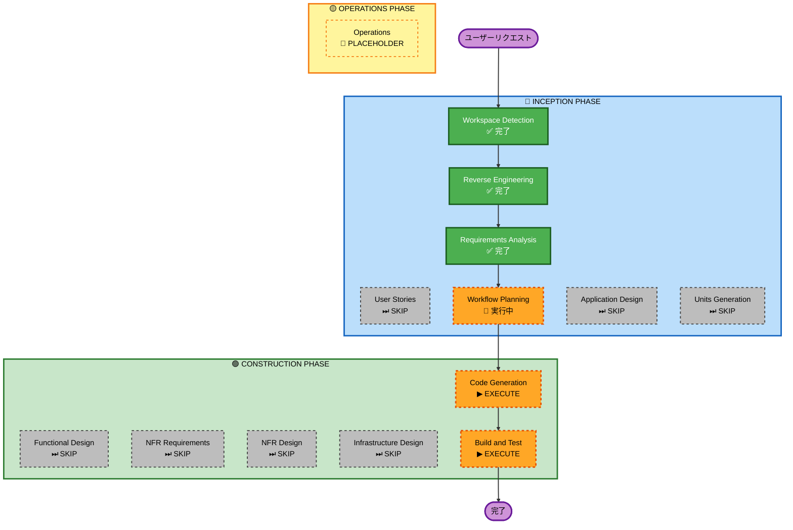

# 実行計画

## 詳細分析サマリー

### 変更スコープ
- **変更タイプ**: Single Component（新規UIコンポーネント追加）
- **主な変更**: `RankingChart` コンポーネント新規作成、`ranking/page.tsx` への組み込み
- **関連コンポーネント**: RankingTable（同一ページに共存）、AgeFilter・JobFilter（フィルタ連動）

### 変更影響評価
- **ユーザー向け変更**: あり — ランキングページにグラフが追加される
- **構造変更**: なし — 既存アーキテクチャに変更なし
- **データモデル変更**: なし — 既存APIをそのまま利用
- **API変更**: なし — `/api/ranking` エンドポイントは変更なし
- **NFR影響**: なし — グラフはページ取得済みデータを再利用するため追加リクエストなし

### リスク評価
- **リスクレベル**: Low
- **ロールバック難易度**: 容易（コンポーネント削除のみ）
- **テスト複雑度**: シンプル（Storybookストーリーで確認）

---

## ワークフロー可視化

---

## 実行フェーズ

### 🔵 INCEPTION PHASE
- [x] Workspace Detection — 完了
- [x] Reverse Engineering — 完了
- [x] Requirements Analysis — 完了
- [x] Workflow Planning — 実行中
- [ ] User Stories — **SKIP** *シンプルなUIコンポーネント追加のためユーザーストーリー不要*
- [ ] Application Design — **SKIP** *新規コンポーネントのスコープが明確なため設計ドキュメント不要*
- [ ] Units Generation — **SKIP** *作業単位が1つのため分解不要*

### 🟢 CONSTRUCTION PHASE
- [ ] Functional Design — **SKIP** *UIのみの変更でビジネスロジックなし*
- [ ] NFR Requirements — **SKIP** *既存NFR設定で十分、追加要件なし*
- [ ] NFR Design — **SKIP** *NFR Requirementsをスキップするため*
- [ ] Infrastructure Design — **SKIP** *インフラ変更なし*
- [ ] **Code Generation — EXECUTE** *Rechartsコンポーネント実装*
- [ ] **Build and Test — EXECUTE** *ビルド確認・Storybook確認*

### 🟡 OPERATIONS PHASE
- [ ] Operations — PLACEHOLDER

---

## 成功基準

- **主目標**: `/ranking` ページに縦棒グラフが表示され、職種・年齢フィルタと連動して更新される
- **主要成果物**:
  - `src/components/RankingChart/RankingChart.tsx`
  - `src/components/RankingChart/RankingChart.stories.ts`
  - `src/app/ranking/page.tsx`（更新）
  - `package.json`（recharts 追加）
- **品質ゲート**:
  - TypeScript エラーなし
  - Storybook でグラフが正常表示
  - フィルタ変更時にグラフが再描画される
  - ダークモード対応
